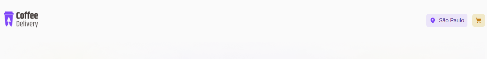
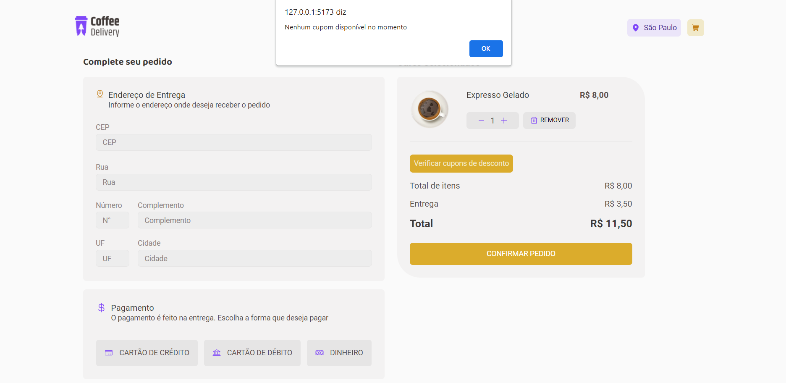

# coffee-delivery-plus-croct

## About

Coffee Delivery is a website focused on selling coffee. This application was developed for the challenge of the Customer Service Engineer job at Croct.
<br>
The project has 3 pages: home to list the products, shopping cart, and completed order. Furthermore, the app gains some personalization features with Croct’s React lib.

## Applied technologies

- Built with [Vite](https://vitejs.dev/);
- [Styled-components](https://styled-components.com/) for styles;
- [React Router](https://reactrouter.com/en/main) to create the router between the pages;
- [Zod](https://github.com/colinhacks/zod) to form validation;
- API [Via CEP](https://viacep.com.br/) to bring informations related to user's address;
- [Croct Plug React](https://github.com/croct-tech/plug-react) to customize some itens.

## Where Croct was applied?

1. Select an application theme based on the commemorative date

Based on alternate themes idea, I used the Croct personalization features to alternate between the themes based on the commemorative date. In this case, I chose Halloween, so on October 31st, the default application theme will change to Halloween.
<br>
For this action to be possible, on App.tsx file the `Personalization` component was used with the validation expression: “today’s day is 31 and today’s month is 10”. This promise returns a boolean value, if it is true the Halloween theme is applied. 
The same idea can be adapted to other commemorative dates such as Christmas and Mother’s Day.
<br>
It is worth highlighting that the same validation expression was used in the Header component to replace the logo image.
<br>
The fallback attribute was used with the negative Boolean value, to prevent application malfunction.
<br>
App component code

```typescript
<Suspense fallback="Customizing theme">
  <Personalization expression="today's day is 31 and today's month is 10" fallback={false}>
    {(isHalloween: boolean) =>
      <ThemeProvider theme={isHalloween ? halloweenTheme : defaultTheme}>
         <CoffeeOrderProvider>
            <DeliveryProvider>
                <Router />
            </DeliveryProvider>
          </CoffeeOrderProvider>
           <GlobalStyle />
        </ThemeProvider>}
  </Personalization>
</Suspense>
```
2. Customized slogans based on user's location

Some banner slogans on the Homepage were personalized based on the user’s location. The alternation between the slogans was possible to be done with the `Personalization` component with the expression “location’s city”, which returns a string with the city’s name.
<br>
Something similar was done with the Header component to show an element with the user’s location, as shown in the picture below.



The code logic to implement this item on the screen was a little different from the one used in the banner. The location variable was defined by the hook `useEvaluation`. The variable type is based on the expression response, in this case can be a string or null if the location is not available. The location icon is just shown on the scrren if the location is a string type.
<br>
Header component code

```typescript
const location = useEvaluation<string | null>("location's city");

(...)

{location &&
    <LocationContainer>
        <MapIcon weight='fill' />
        <span>{location}</span>
    </LocationContainer>
}
```

3. Coffee suggestions based on the weekday if the cart is empty

If no items are selected, on the cart page some coffee suggestions are going to be shown based on the weekday. To do this kind of personalization I chose to create a React component `EmptyCartPersonalization` and use the `usePersinalization` hook. The expression used to evaluate was “today’s weekday” and the type return is a string.
<br>
I highlight that in this case, a `Slot` component has more advantages, letting the code clean. The `Slot` component was not used because is necessary an id configuration for this usage. The app ID received had a configuration to show different messages based on the user’s persona.

4. Discount coupon alert

At the checkout, the application’s user can check if a discount is available. This kind of evaluation was done with the useCroct hook and the useCallback hook.

## Video application details (in Portuguese)

https://clipchamp.com/watch/c1S9uCL3e4W

## Layout





## Run the application

Type `npm run dev` to run the application on localhost

## Additional infos

- Author: [Yasmin](https://www.linkedin.com/in/yasmin-goncalves/)
- Challenge by Croct.

## Sobre

O Coffee Delivery é uma página de e-commerce de venda de cafés, desenvolvidada para o challenge do processo seletivo para Customer Service Engineer da Croct.
<br>
A aplicação conta com um total de 3 páginas: listagem de produtos, carrinho de compras e pedido finalizado. Além disso, a aplicação ganha um plus de personalização com a Lib de React da Croct.

## Tecnologias utilizadas

- Aplicação construída com [Vite](https://vitejs.dev/);
- [Styled-components](https://styled-components.com/) para estilização;
- Criação das rotas com [React Router](https://reactrouter.com/en/main);
- Validação do formulário de entrega com a biblioteca [Zod](https://github.com/colinhacks/zod) e [React Hook Form](https://react-hook-form.com/);
- API [Via CEP](https://viacep.com.br/) para preencher informações de entrega baseado no CEP fornecido;
- [Croct Plug React](https://github.com/croct-tech/plug-react) para personalizações.

## Onde a Croct foi aplicada?

1. Seleção do tema da aplicação baseado na data comemorativa

Baseado na ideia de alternância de temas, utilizei os recursos de personalização da Croct para fazer a mudança entre os temas da aplicação (default e halloween). O tema halloween será aplicado exclusivamente no dia 31/10, essa troca será feita de forma automática.
<br> 
Para que essa ação fosse possível, dentro do arquivo App.tsx, por volta do componente ThemeProvider foi utilizado o componente `Personalization` com a expressão de validação: "today's day is 31 and today's month is 10". Essa expressão retornará um valor booleano, para o caso verdadeiro o tema de halloween será aplicado, caso seja falso o tema padrão será aplicado.
A mesma ideia pode ser adaptada para outras datas comemorativas como Natal, Dia dos Namorados e Dia das Mães, bastando trocar a expressão de validação e o tema.
<br>
Cabe destacar que lógica semelhante, com a mesma expressão de validação, foi utilizada no componente Header, mais especificamente na imagem de logo. Quando o tema da aplicação é alternado a imagem de logo deve ser alterada por conta do contraste entre as cores.
<br>
Optou-se por utilizar o atributo fallback com o valor booleano falso, para caso a validação falhar a aplicação como um todo não ser comprometida.
<br>
Código do componente App:

```typescript
<Suspense fallback="Customizing theme">
  <Personalization expression="today's day is 31 and today's month is 10" fallback={false}>
    {(isHalloween: boolean) =>
      <ThemeProvider theme={isHalloween ? halloweenTheme : defaultTheme}>
         <CoffeeOrderProvider>
            <DeliveryProvider>
                <Router />
            </DeliveryProvider>
          </CoffeeOrderProvider>
           <GlobalStyle />
        </ThemeProvider>}
  </Personalization>
  </Suspense>
```
2. Frases personalizadas baseadas na localização do usuário

No banner da página inicial frases customizadas são apresentadas ao usuário baseada na sua localização aproximada. Desta forma, a frase que anteriormente era "Encontre o café perfeito para qualquer hora do dia" passa a ser "Está na correria de São Paulo? Encontre o café perfeito para qualquer hora do dia".
A alternância entre as frases foi feita com o componente `Personalization` e a expressão de validação "location's city", que retorna uma string com o nome da cidade.
<br>
Algo semelhante foi feito no componente Header com a intenção de apresentar a localização do usuário, como mostra a imagem abaixo.


A lógica de apresentação desse item em tela foi um pouco diferente do utilizado no banner. A variável location foi definida a partir do valor da expressão "location's city", utilizando o hook `useEvaluation`. A tipagem dessa variável é baseada na resposta da expressão avaliada pelo hook, neste caso pode ser uma string com o nome da cidade ou null caso não seja possível obter a localização. 
A apresentação do item de localização da tela só acontece se a variável location for uma string.
<br>
No código ficou da seguinte forma:

```typescript
const location = useEvaluation<string | null>("location's city");

(...)

{location &&
    <LocationContainer>
        <MapIcon weight='fill' />
        <span>{location}</span>
    </LocationContainer>
}
```
3. Sugestões de cafés baseado no dia da semana caso o carrinho esteja vazio

Caso o usuário acesse o carrinho de compras sem nenhum café selecionado, sugestões serão apresentadas baseado no dia da semana. 
Para realizar esse tipo de personalização optei por criar o componente React `EmptyCartPersonalization` e utilizar o hook `usePersonalization`. A expressão avaliada foi "today´s weekday", sendo a tipagem de retorno uma string, neste caso números entre 0 e 6. O retorno desse componente são as sugestões de cafés, diferentes para cada dia da semana.
<br>
O componente `EmptyCartPersonalization` foi utilizado dentro do componente `Cart` e envelopado pelo `Suspense` do React.
<br>
Destaco que para este caso a utilização do componente `Slot` teria maiores vantagens, deixando o código menos verboso já que para a solução adotada foi necessário escrever um código para cada dia da semana. O `Slot` não foi utilizado pois é necessário a configuração de um id específico para essa funcionalidade, o app ID fornecido possui o id configurado para apresentar diferentes expressões baseado na persona do usuário, não cabendo para a aplicação construída.

4. Alert indicando se há cupons de desconto no dia

Na finalização do pedido o usuário pode verificar a existência de cupons de desconto a partir do clique em um botão. Ao clicar no botão em questão uma função será disparada, essa função irá avaliar qual o dia da semana e retornar um alert se há ou não descontos. 
<br>
Tal função foi criada com o apoio do useCallback do React e o hook useCroct, que dá acesso as funções da lib de JS. 

## Detalhes da aplicação em vídeo

https://clipchamp.com/watch/c1S9uCL3e4W

## Layout da aplicação


## Executar a aplicação

A aplicação pode ser executada em localhost a partir do comando `npm run dev`

## Dados complementares

- Autor: [Yasmin](https://www.linkedin.com/in/yasmin-goncalves/)
- Challenge by Croct.
