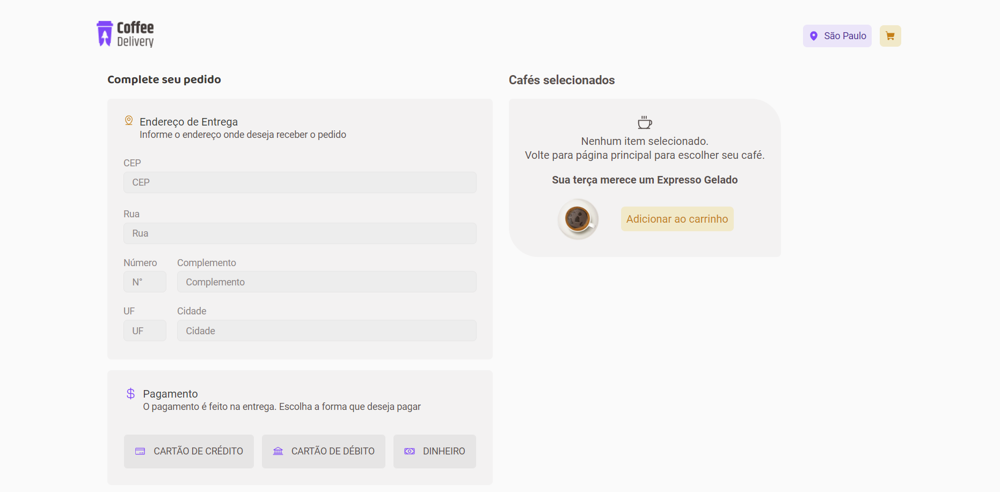

# coffee-delivery-plus-croct

## Sobre

O Coffee Delivery é uma página de e-commerce de venda de cafés, desenvolvidada para o challenge do processo seletivo para Customer Service Engineer da Croct.
 
A aplicação conta com um total de 3 páginas: listagem de produtos, carrinho de compras e pedido finalizado. Além disso, a aplicação ganha um plus de personalização com a Lib de React da Croct.

## Tecnologias utilizadas

- Aplicação construída com [Vite](https://vitejs.dev/);
- [Styled-components](https://styled-components.com/) para estilização;
- Criação das rotas com [React Router](https://reactrouter.com/en/main);
- Validação do formulário de entrega com a biblioteca [Zod](https://github.com/colinhacks/zod);
- API [Via CEP](https://viacep.com.br/) para preencher informações de entrega baseado no CEP fornecido;
- [Croct Plug React](https://github.com/croct-tech/plug-react) para personalizações.

## Onde a Croct foi aplicada?

## Construção

O Coffe Delivery foi criado com React e TypeScript, sendo a base do projeto criada com o Vite. A navegação entre as páginas (Home, Carrinho e Pedido Finalizado) foi possível através do uso da biblioteca React Router Dom, os formulários foram tratados com as bibliotecas React Hook Form e Zod integradas. A estilização foi feita com Styled-components.
 
Foram implandadas como melhoria da aplicação: responsividade, aplicando o conceito de mobile first, e consumo da API Via CEP.
Os dados do formulário referentes ao endereço estão sendo preenchidas automaticamente a partir do consumo da API Via CEP, desta forma, basta o usuário informar o CEP da entrega que as informações de setor, rua, bairro e cidade já são preenchidas.

### Novidades no projeto

- Consumo da API Via Cep;
- Responsividade (mobile-first).

### Principais ferramentas utilizadas

- Construído com [Vite](https://vitejs.dev/);
- Estilização com [Styled-components](https://styled-components.com/);
- [React Router](https://reactrouter.com/en/main) para criação das rotas da aplicação;
- [React Hook Form](https://react-hook-form.com/) para lidar com formulários;
- [Zod](https://github.com/colinhacks/zod) para validação de formulários;
- Dados de endereço do usuário foram obtidos através do consumo da API [Via CEP](https://viacep.com.br/).

## Layout da aplicação

## Deploy da aplicação

"Em breve"
 
Caso prefira abrir a aplicação no localhost basta digitar o comando `npm run dev`

## Vídeo da aplicação

[Coffe Delivery](https://www.loom.com/share/8af0eda9dc9a425e8407fc2f2e9712e7)

## Dados complementares

- Autor: [Yasmin](https://www.linkedin.com/in/yasmin-goncalves/)

## About

Coffee Delivery is a coffee sales e-commerce, developed for the challenge of the selection process for Customer Service Engineer at Croct.