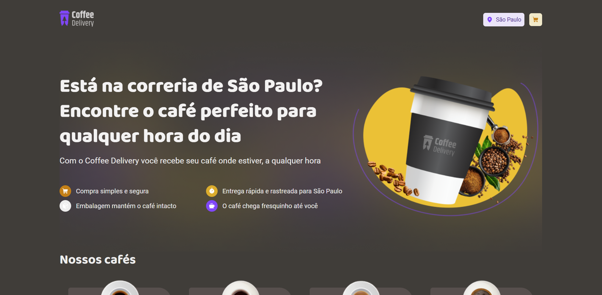

# coffee-delivery-plus-croct

## About

Coffee Delivery is a website focused on selling coffee. This application was developed for the challenge of the Customer Service Engineer job at Croct.
<br>
The project has 3 pages: home to list the products, shopping cart, and completed order. Furthermore, the app gains some personalization features with Croct’s React lib.

## Applied technologies

- Built with [Vite](https://vitejs.dev/);
- [Styled-components](https://styled-components.com/) for styles;
- [React Router](https://reactrouter.com/en/main) to create the router between the pages;
- [Zod](https://github.com/colinhacks/zod) to form validation;
- API [Via CEP](https://viacep.com.br/) to bring informations related to user's address;
- [Croct Plug React](https://github.com/croct-tech/plug-react) to customize some itens.

## Where Croct was applied?

1. Select an application theme based on the commemorative date

Based on alternate themes idea, I used the Croct personalization features to alternate between the themes based on the commemorative date. In this case, I chose Halloween, so on October 31st, the default application theme will change to Halloween.
<br>
For this action to be possible, on App.tsx file the `Personalization` component was used with the validation expression: “today’s day is 31 and today’s month is 10”. This promise returns a boolean value, if it is true the Halloween theme is applied. 
The same idea can be adapted to other commemorative dates such as Christmas and Mother’s Day.
<br>
It is worth highlighting that the same validation expression was used in the Header component to replace the logo image.
<br>
The fallback attribute was used with the negative Boolean value, to prevent application malfunction.
<br>
App  component code

```typescript
<Suspense fallback="Customizing theme">
        <Personalization expression="today's day is 31 and today's month is 10" fallback={false}>
          {(isHalloween: boolean) =>
            <ThemeProvider theme={isHalloween ? halloweenTheme : defaultTheme}>
              <CoffeeOrderProvider>
                <DeliveryProvider>
                  <Router />
                </DeliveryProvider>
              </CoffeeOrderProvider>
              <GlobalStyle />
            </ThemeProvider>}
        </Personalization>
      </Suspense>
```
2. Customized slogans based on user's location

Some banner slogans on the Homepage were personalized based on the user’s location. The alternation between the slogans was possible to be done with the `Personalization` component with the expression “location’s city”, which returns a string with the city’s name.
<br>
Something similar was done with the Header component to show an element with the user’s location, as shown in the picture below.


3. Coffee suggestions based on the weekday if the cart is empty
4. Discount coupon alert

## Video application details (in Portuguese)

https://clipchamp.com/watch/c1S9uCL3e4W

## Layout




## Run the application

Type `npm run dev` to run the application on localhost

## Additional infos

- Author: [Yasmin](https://www.linkedin.com/in/yasmin-goncalves/)
- Challenge by Croct.