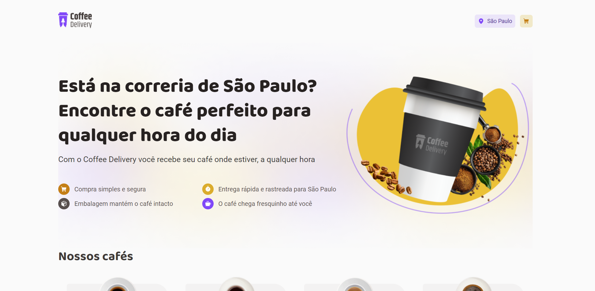
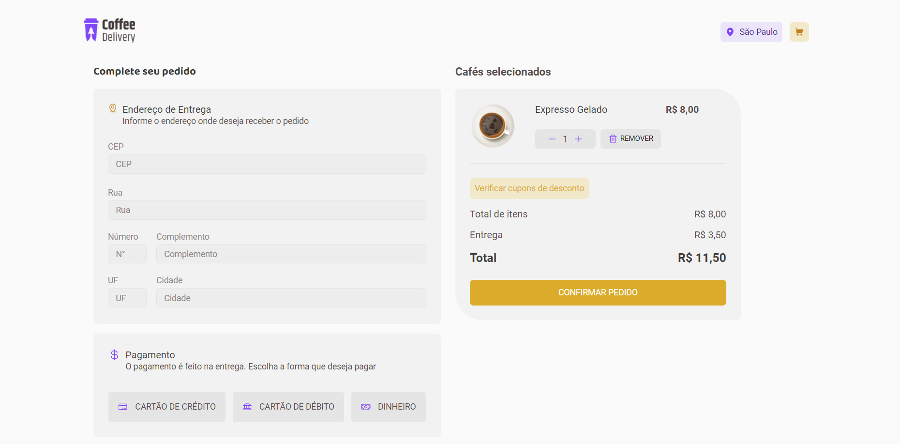

# coffee-delivery-plus-croct

## About

Coffee Delivery is a website focused on selling coffee. This application was developed for the challenge of the Customer Service Engineer job at Croct.
 
The project has 3 pages: home to list the products, shopping cart, and completed order. Furthermore, the app gains some personalization features with Croct’s React lib.

## Applied technologies

- Built with [Vite](https://vitejs.dev/);
- [Styled-components](https://styled-components.com/) for styles;
- [React Router](https://reactrouter.com/en/main) to create the router between the pages;
- [Zod](https://github.com/colinhacks/zod) to form validation;
- API [Via CEP](https://viacep.com.br/) to bring informations related to user's address;
- [Croct Plug React](https://github.com/croct-tech/plug-react) to customize some itens.

## Where Croct was applied?

1. Select an application theme based on the commemorative date
2. Customized slogans based on user's location
3. Coffee suggestions based on the weekday if the cart is empty
4. Discount coupon alert

## Video application details (in Portuguese)

https://clipchamp.com/watch/c1S9uCL3e4W

## Layout

## Run the application

Type `npm run dev` to run the application on localhost

## Additional infos

- Author: [Yasmin](https://www.linkedin.com/in/yasmin-goncalves/)
- Challenge by Croct.